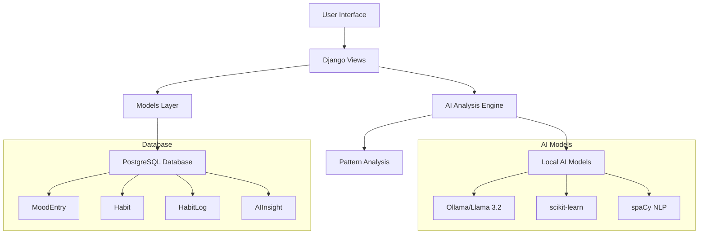
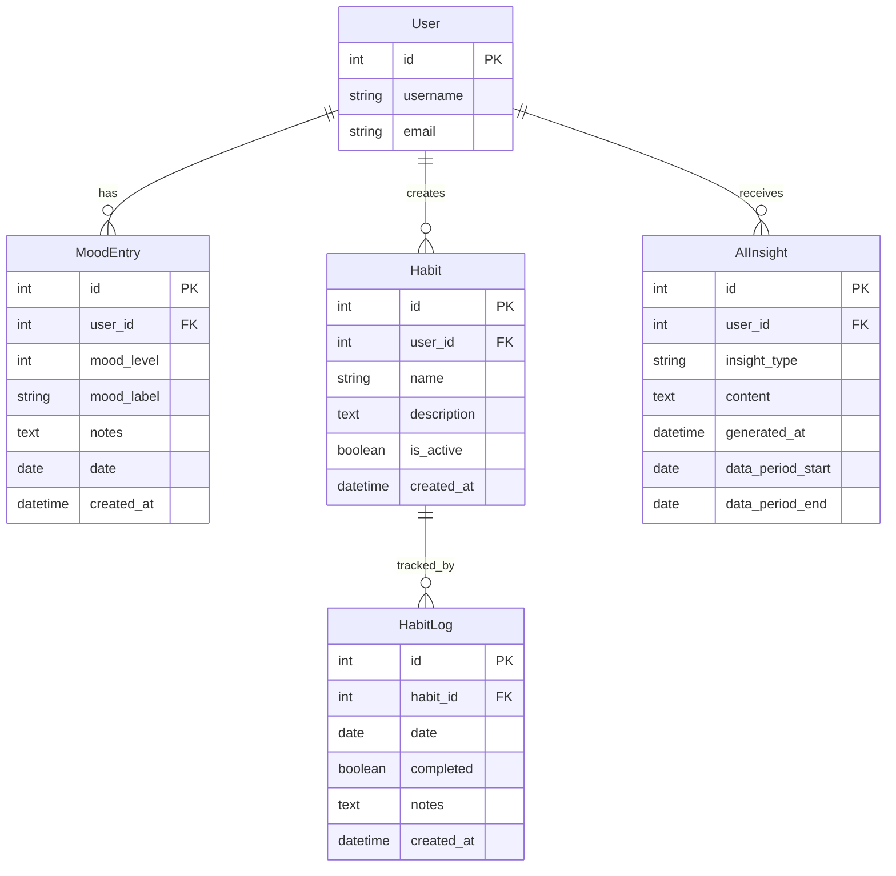

# Design Document - Mood and Habit Tracker

## Overview

The Mood and Habit Tracker is a Django application that integrates seamlessly with the existing Smart Journal system. It provides users with simple tools to log daily moods, track habits, and receive AI-powered insights about their patterns. The system emphasizes simplicity, privacy, and local processing using open-source AI models.

## Architecture

### High-Level Architecture



### Integration Points

- **Authentication**: Uses existing Django User model and allauth system
- **Navigation**: Integrates with existing header navigation dropdown
- **Styling**: Follows existing Tailwind CSS design patterns
- **Database**: Extends current PostgreSQL database
- **URL Structure**: Follows `/tracker/` namespace pattern

## Components and Interfaces

### 1. Django App Structure

```
mood_tracker/
├── __init__.py
├── admin.py
├── apps.py
├── models.py          # MoodEntry, Habit, HabitLog, AIInsight
├── views.py           # Dashboard, mood/habit CRUD operations
├── urls.py            # URL routing
├── forms.py           # Django forms for mood/habit input
├── ai_engine.py       # AI analysis logic
├── utils.py           # Helper functions
├── migrations/
└── templates/
    └── mood_tracker/
        ├── dashboard.html
        ├── mood_log.html
        ├── habit_list.html
        └── insights.html
```

### 2. Core Models

#### MoodEntry Model
```python
class MoodEntry(models.Model):
    user = models.ForeignKey(User, on_delete=models.CASCADE)
    mood_level = models.IntegerField(choices=MOOD_CHOICES)  # 1-5 scale
    mood_label = models.CharField(max_length=20)  # Happy, Sad, Anxious, etc.
    notes = models.TextField(blank=True)
    date = models.DateField(default=timezone.now)
    created_at = models.DateTimeField(auto_now_add=True)
```

#### Habit Model
```python
class Habit(models.Model):
    user = models.ForeignKey(User, on_delete=models.CASCADE)
    name = models.CharField(max_length=100)
    description = models.TextField(blank=True)
    is_active = models.BooleanField(default=True)
    created_at = models.DateTimeField(auto_now_add=True)
```

#### HabitLog Model
```python
class HabitLog(models.Model):
    habit = models.ForeignKey(Habit, on_delete=models.CASCADE)
    date = models.DateField(default=timezone.now)
    completed = models.BooleanField(default=False)
    notes = models.TextField(blank=True)
    created_at = models.DateTimeField(auto_now_add=True)
```

#### AIInsight Model
```python
class AIInsight(models.Model):
    user = models.ForeignKey(User, on_delete=models.CASCADE)
    insight_type = models.CharField(max_length=20)  # weekly, monthly, correlation
    content = models.TextField()
    generated_at = models.DateTimeField(auto_now_add=True)
    data_period_start = models.DateField()
    data_period_end = models.DateField()
```

### 3. AI Analysis Engine

#### Local AI Model Integration
- **Primary Model**: Ollama with Llama 3.2 (3B) for natural language insights
- **Fallback**: scikit-learn for statistical analysis if Ollama unavailable
- **Text Processing**: spaCy for mood note analysis

#### Analysis Components
```python
class AIAnalysisEngine:
    def __init__(self):
        self.ollama_client = self._init_ollama()
        self.sklearn_analyzer = StatisticalAnalyzer()
    
    def generate_weekly_insights(self, user_id):
        # Analyze mood patterns, habit correlations
        # Generate actionable recommendations
        
    def detect_mood_patterns(self, mood_data):
        # Identify trends, cycles, anomalies
        
    def analyze_habit_correlations(self, mood_data, habit_data):
        # Find relationships between habits and mood
```

### 4. User Interface Components

#### Dashboard Layout
- **Mood Section**: Today's mood + 7-day trend chart
- **Habits Section**: Daily checklist + streak counters
- **Insights Section**: Latest AI-generated recommendations
- **Quick Stats**: Current streaks, completion rates

#### Navigation Integration
- Add "Tracker" item to existing header dropdown menu
- Maintain consistent styling with journal interface

## Data Models

### Mood Scale Definition
```python
MOOD_CHOICES = [
    (1, 'Very Low'),
    (2, 'Low'), 
    (3, 'Neutral'),
    (4, 'Good'),
    (5, 'Excellent')
]

MOOD_LABELS = [
    'Happy', 'Sad', 'Anxious', 'Calm', 'Energetic', 
    'Tired', 'Focused', 'Stressed', 'Content', 'Frustrated'
]
```

### Database Relationships


## Error Handling

### AI Model Availability
- **Graceful Degradation**: Fall back to statistical analysis if Ollama unavailable
- **User Feedback**: Clear messaging when AI features are limited
- **Retry Logic**: Automatic retry for temporary AI service failures

### Data Validation
- **Mood Entries**: Validate date uniqueness per user
- **Habit Logs**: Prevent duplicate entries for same habit/date
- **Input Sanitization**: Clean user input for notes and descriptions

### Performance Considerations
- **Lazy Loading**: Load insights only when requested
- **Caching**: Cache AI analysis results for 24 hours
- **Background Processing**: Generate insights asynchronously using Celery (optional)

## Testing Strategy

### Unit Tests
- Model validation and constraints
- AI engine analysis functions
- Utility functions for data processing

### Integration Tests
- View responses and template rendering
- Database operations and relationships
- AI model integration (with mocks)

### User Interface Tests
- Form submissions and validation
- Dashboard data display
- Navigation integration

### Performance Tests
- AI analysis response times
- Database query optimization
- Large dataset handling

## Security Considerations

### Data Privacy
- All AI processing happens locally
- No external API calls for sensitive data
- User data isolation and access controls

### Input Validation
- Sanitize all user inputs
- Validate date ranges and numeric inputs
- Prevent SQL injection through ORM usage

### Authentication
- Leverage existing Django authentication
- Ensure all views require login
- Implement proper permission checks

## Deployment Requirements

### Dependencies
```python
# AI and ML libraries
ollama>=0.1.0
scikit-learn>=1.3.0
spacy>=3.7.0
numpy>=1.24.0
pandas>=2.0.0

# Visualization (optional)
plotly>=5.15.0
```

### System Requirements
- **RAM**: Minimum 4GB for Ollama models
- **Storage**: 2GB for Llama 3.2 3B model
- **CPU**: Multi-core recommended for AI processing

### Configuration
- Environment variables for AI model paths
- Settings for analysis frequency and caching
- Optional Celery configuration for background tasks

## Future Enhancements

### Phase 2 Features
- Export data to CSV/JSON
- Custom mood labels and scales
- Habit categories and tags
- Social sharing (optional)

### Advanced AI Features
- Predictive mood modeling
- Personalized habit recommendations
- Integration with wearable devices
- Natural language query interface

### Performance Optimizations
- Real-time dashboard updates
- Progressive web app features
- Offline data entry capabilities