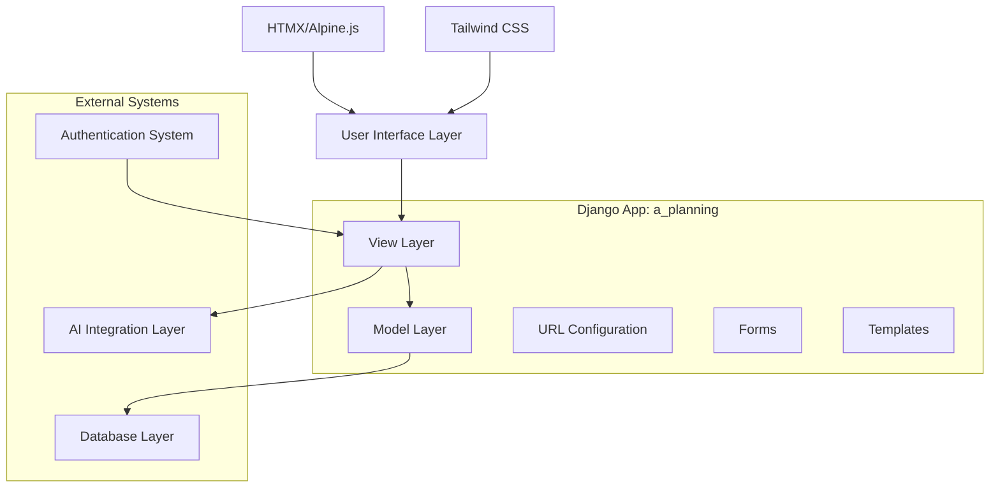
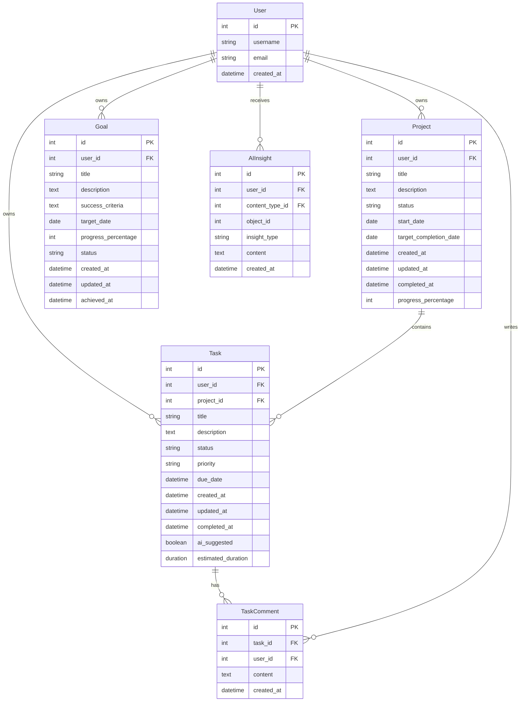

# Design Document

## Overview

The Task & Project Planning Module is designed as a Django app (`a_planning`) focusing on two core entities: **Tasks** and **Projects** with a joint relationship. The module follows Django's MVT pattern and emphasizes modern, user-friendly interfaces with comprehensive CRUD operations and intelligent AI assistance.

The design prioritizes:
- **Two-Entity Focus**: Tasks and Projects as the main entities with clear relationships
- **Modern UI/UX**: Clean, responsive interface with smooth interactions
- **CRUD Excellence**: Comprehensive Create, Read, Update, Delete operations
- **AI Integration**: Smart suggestions and automation for enhanced productivity
- **Real-time Updates**: HTMX-powered dynamic interactions without page reloads

## Architecture

### High-Level Architecture



### Component Architecture

The module consists of the following core components:

1. **Models**: Task, Project, Goal, and supporting models
2. **Views**: Function-based and class-based views for CRUD operations
3. **Templates**: Responsive HTML templates with HTMX integration
4. **Forms**: Django forms for data validation and user input
5. **URLs**: RESTful URL patterns for navigation
6. **AI Integration**: Service layer for AI-powered features

## Components and Interfaces

### Models

#### Task Model
```python
class Task(models.Model):
    # Core fields
    title = CharField(max_length=200)
    description = TextField(blank=True)
    user = ForeignKey(User, on_delete=CASCADE)
    project = ForeignKey(Project, null=True, blank=True, on_delete=SET_NULL)
    
    # Status and priority
    status = CharField(max_length=20, choices=STATUS_CHOICES, default='pending')
    priority = CharField(max_length=10, choices=PRIORITY_CHOICES, default='medium')
    
    # Dates
    created_at = DateTimeField(auto_now_add=True)
    updated_at = DateTimeField(auto_now=True)
    due_date = DateTimeField(null=True, blank=True)
    completed_at = DateTimeField(null=True, blank=True)
    
    # AI features
    ai_suggested = BooleanField(default=False)
    estimated_duration = DurationField(null=True, blank=True)
```

#### Project Model
```python
class Project(models.Model):
    title = CharField(max_length=200)
    description = TextField(blank=True)
    user = ForeignKey(User, on_delete=CASCADE)
    
    # Status and dates
    status = CharField(max_length=20, choices=PROJECT_STATUS_CHOICES, default='active')
    created_at = DateTimeField(auto_now_add=True)
    updated_at = DateTimeField(auto_now=True)
    start_date = DateField(null=True, blank=True)
    target_completion_date = DateField(null=True, blank=True)
    completed_at = DateTimeField(null=True, blank=True)
    
    # Progress tracking
    progress_percentage = IntegerField(default=0)
```

#### Goal Model
```python
class Goal(models.Model):
    title = CharField(max_length=200)
    description = TextField(blank=True)
    user = ForeignKey(User, on_delete=CASCADE)
    
    # Goal specifics
    success_criteria = TextField()
    target_date = DateField()
    progress_percentage = IntegerField(default=0)
    
    # Status tracking
    status = CharField(max_length=20, choices=GOAL_STATUS_CHOICES, default='active')
    created_at = DateTimeField(auto_now_add=True)
    updated_at = DateTimeField(auto_now=True)
    achieved_at = DateTimeField(null=True, blank=True)
```

#### Supporting Models
```python
class TaskComment(models.Model):
    task = ForeignKey(Task, on_delete=CASCADE, related_name='comments')
    user = ForeignKey(User, on_delete=CASCADE)
    content = TextField()
    created_at = DateTimeField(auto_now_add=True)

class AIInsight(models.Model):
    user = ForeignKey(User, on_delete=CASCADE)
    content_type = ForeignKey(ContentType, on_delete=CASCADE)
    object_id = PositiveIntegerField()
    content_object = GenericForeignKey('content_type', 'object_id')
    insight_type = CharField(max_length=50)
    content = TextField()
    created_at = DateTimeField(auto_now_add=True)
```

### Views Architecture

#### Dashboard Views
- `dashboard_view`: Main planning dashboard with overview
- `dashboard_ajax`: HTMX endpoint for dashboard updates

#### Task Views
- `task_list_view`: Display user's tasks with filtering
- `task_create_view`: Create new tasks
- `task_detail_view`: View and edit task details
- `task_update_view`: HTMX endpoint for task updates
- `task_delete_view`: Delete tasks with confirmation

#### Project Views
- `project_list_view`: Display user's projects
- `project_create_view`: Create new projects
- `project_detail_view`: Project overview with tasks
- `project_update_view`: Edit project details
- `project_delete_view`: Delete projects

#### Goal Views
- `goal_list_view`: Display user's goals
- `goal_create_view`: Create new goals
- `goal_detail_view`: Goal tracking and progress
- `goal_update_view`: Update goal progress
- `goal_delete_view`: Delete goals

#### AI Integration Views
- `ai_suggestions_view`: Get AI task/project suggestions
- `ai_insights_view`: Display AI insights and recommendations

### URL Structure

```
/planning/
├── dashboard/                 # Main dashboard
├── tasks/
│   ├── list/                 # Task list with filters
│   ├── create/               # Create new task
│   ├── <id>/                 # Task detail
│   ├── <id>/edit/            # Edit task
│   └── <id>/delete/          # Delete task
├── projects/
│   ├── list/                 # Project list
│   ├── create/               # Create project
│   ├── <id>/                 # Project detail
│   ├── <id>/edit/            # Edit project
│   └── <id>/delete/          # Delete project
├── goals/
│   ├── list/                 # Goal list
│   ├── create/               # Create goal
│   ├── <id>/                 # Goal detail
│   ├── <id>/edit/            # Edit goal
│   └── <id>/delete/          # Delete goal
└── ai/
    ├── suggestions/          # AI suggestions
    └── insights/             # AI insights
```

### Template Structure

```
templates/a_planning/
├── base_planning.html        # Base template extending base.html
├── dashboard.html            # Main dashboard
├── tasks/
│   ├── task_list.html       # Task list with filters
│   ├── task_form.html       # Task create/edit form
│   ├── task_detail.html     # Task detail view
│   └── partials/
│       ├── task_card.html   # Individual task card
│       ├── task_form_modal.html
│       └── task_filters.html
├── projects/
│   ├── project_list.html
│   ├── project_form.html
│   ├── project_detail.html
│   └── partials/
│       ├── project_card.html
│       ├── project_progress.html
│       └── project_tasks.html
├── goals/
│   ├── goal_list.html
│   ├── goal_form.html
│   ├── goal_detail.html
│   └── partials/
│       ├── goal_card.html
│       ├── goal_progress.html
│       └── goal_timeline.html
└── partials/
    ├── ai_suggestions.html
    ├── quick_actions.html
    └── stats_overview.html
```

## Data Models

### Entity Relationship Diagram



### Data Validation Rules

- **Task titles**: Required, max 200 characters
- **Due dates**: Must be in the future when creating
- **Priority levels**: Low, Medium, High, Urgent
- **Status values**: Pending, In Progress, Completed, Cancelled
- **Progress percentages**: 0-100 integer values
- **User associations**: All data must be associated with authenticated users

## Error Handling

### Validation Errors
- Form validation using Django's built-in validators
- Custom validators for business logic (e.g., due dates, progress percentages)
- Client-side validation using Alpine.js for immediate feedback
- Server-side validation as the authoritative source

### Database Errors
- Graceful handling of database connection issues
- Transaction rollback for data integrity
- Proper error logging for debugging
- User-friendly error messages

### AI Integration Errors
- Fallback behavior when AI services are unavailable
- Timeout handling for AI API calls
- Error logging for AI service failures
- Graceful degradation of AI features

### User Experience Errors
- 404 pages for missing resources
- Permission denied handling
- Session timeout management
- Progressive enhancement for JavaScript failures

## Testing Strategy

### Unit Tests
- Model validation and business logic
- Form validation and data processing
- Utility functions and helpers
- AI integration service methods

### Integration Tests
- View functionality and response handling
- Database operations and data integrity
- User authentication and authorization
- HTMX endpoint behavior

### User Interface Tests
- Template rendering and context data
- Form submission and validation display
- HTMX interactions and dynamic updates
- Responsive design across devices

### Performance Tests
- Database query optimization
- Page load times and rendering performance
- AI service response times
- Concurrent user handling

### Security Tests
- User data isolation and privacy
- Input sanitization and XSS prevention
- CSRF protection verification
- Authentication and authorization checks

## AI Integration Architecture

### AI Service Layer
```python
class AIPlanningService:
    def suggest_tasks(self, user, context):
        # Analyze user patterns and suggest relevant tasks
        pass
    
    def recommend_project_structure(self, project_description):
        # Suggest tasks and milestones for a project
        pass
    
    def analyze_goal_feasibility(self, goal):
        # Provide insights on goal achievability
        pass
    
    def prioritize_tasks(self, tasks, user_context):
        # AI-powered task prioritization
        pass
```

### AI Features Implementation
- **Task Suggestions**: Based on user history and patterns
- **Project Planning**: Automated task breakdown for projects
- **Goal Insights**: Feasibility analysis and milestone suggestions
- **Smart Prioritization**: Context-aware task ordering
- **Progress Predictions**: Estimated completion times
- **Productivity Insights**: Pattern analysis and recommendations

The AI integration will be implemented as a separate service layer that can be easily extended or replaced, ensuring the core functionality remains independent of AI capabilities.